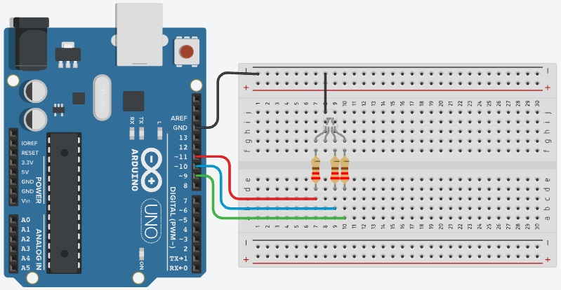

# Projeto Arduíno manipulando LED RGB.

## Contextualização

Neste experimento você irá fazer com que um LED RGB controlado pelas portas digitais 9, 10 e 11 (PMW) acendam de forma intermitente. O LED RGB possui 3 LEDs em seu interior, onde o pino 9 controla o LED vermelho, 10 controla o LED azul e o 11 controla o verde. O brilho de cada LED é controlado atribuindo um valor entre 0 e 255.

## Lista de componentes:

- 1 – Arduíno UNO R3
- 1 – Um cabo de conexão USB
- 1 – Placa de prototipação (Protoboard)
- 1 – LED RGB
- 3 – Resistor de 220 Ω ohms
- 5 – Jumpers (macho-macho)

## Esquema do projeto

## Projeto no Tinkercad

https://www.tinkercad.com/things/gu63mGZm6K3

## Experimentar e pesquisar:

- O que significa RGB?
- Qual a função de cada conector do LED RGB?
- O LED RGB possui 3 LEDs em seu interior, e estes podem ser ligados de forma independente. Então mudando o brilho desses leds, podemos obter muitas outras cores. 
	-  Exiba a cor amarela na sequência de cores.
	-  Inclua na sequência anterior a cor ciana.
	-  Inclua na sequência anterior a cor magenta.
